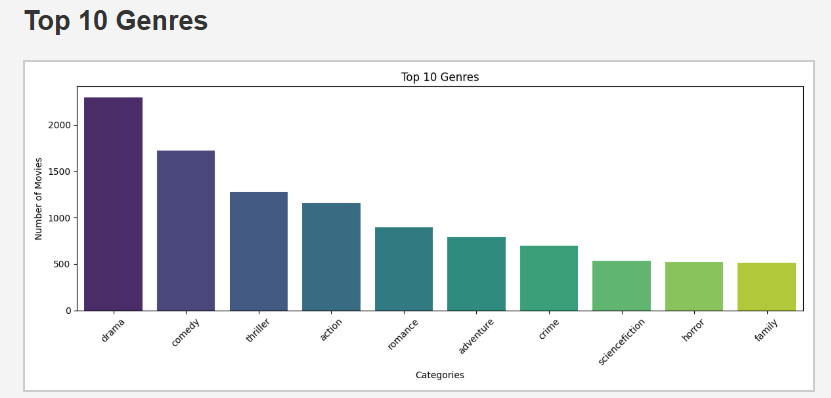
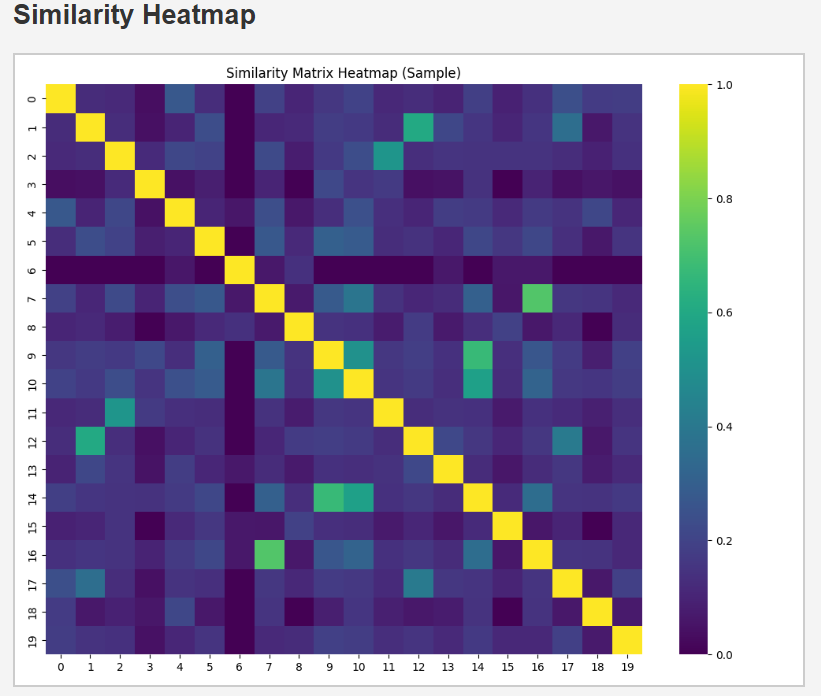

# 🎬 Movie Recommender System

This is a simple **Content-Based Movie Recommender System** built with **Flask**, **Pandas**, **Scikit-learn**, and **NLP techniques**.

It uses TMDB 5000 movies and credits data to recommend similar movies based on:
- Genres
- Keywords
- Cast
- Director

The project includes:
- NLP preprocessing
- Cosine similarity matching
- Interactive web interface with Flask
- Genre distribution and similarity matrix visualized with Matplotlib & Seaborn

---

## 📂 Project Structure

📦 Movie-Recommender-System
┣ 📂 static
┃ ┣ 📄 genres_plot.png
┃ ┣ 📄 heatmap.png
┃ ┣ 📄 style.css
┣ 📂 templates
┃ ┣ 📄 index.html
┃ ┣ 📄 recommend.html
┣ 📄 app.py
┣ 📄 movies.pkl
┣ 📄 similarity.pkl
┣ 📄 tmdb_5000_credits.csv
┣ 📄 tmdb_5000_movies.csv
┣ 📄 requirements.txt
┣ 📄 README.md


---

## 🚀 How to Run

1️⃣ **Clone the repo:**
```bash
git clone https://github.com/ANUBHAV0112/Movie-Recommender-System.git
cd Movie-Recommender-System


2️⃣ Install dependencies:

pip install -r requirements.txt

3️⃣ Run the Flask app:

python app.py

4️⃣ Open your browser:

Go to http://127.0.0.1:5000

```

📊 Visualizations

Top 10 Movie Genres: Shows the distribution of top genres.

Similarity Heatmap: Visualizes the similarity matrix for sample movies.

---

**Plot**  


**Heatmap**  



---

👨‍💻 Author

**Anubhav Choudhary**  
[LinkedIn](https://www.linkedin.com/in/anubhav-choudhary-35b8ab254/) | [GitHub](https://github.com/ANUBHAV0112)

---