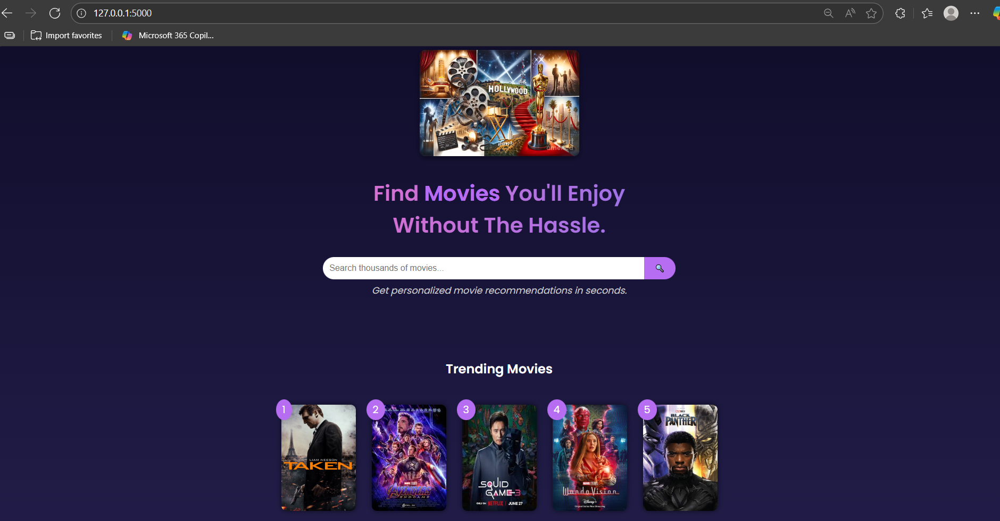
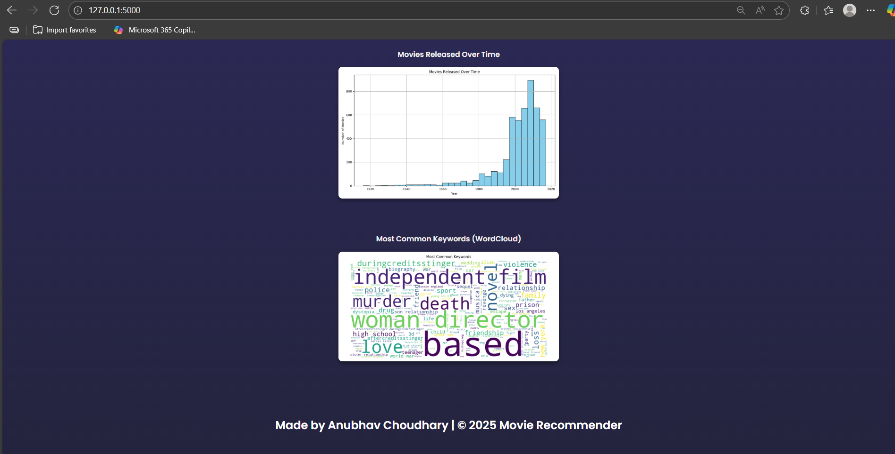
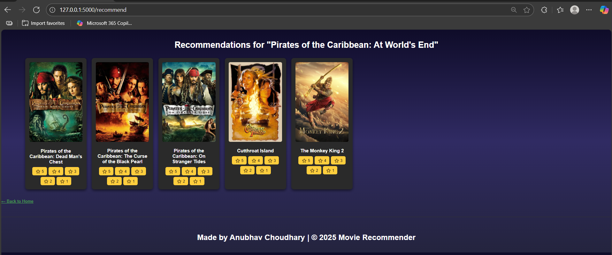

# 🎬 Movie Recommender System

This is a simple content-based movie recommender system built using **Python**, **Flask**, **Scikit-learn**, **NLP**, and **TMDB API** for fetching movie posters dynamically.

It uses TMDB 5000 movies and credits data to recommend similar movies based on:
- Genres
- Keywords
- Cast
- Director

The project includes:
- NLP preprocessing
- Cosine similarity matching
- Interactive web interface with Flask
- Genre distribution and similarity matrix visualized with Matplotlib & Seaborn

---

---

## 📡 How We Use the TMDB API

This project uses **[The Movie Database (TMDB) API](https://www.themoviedb.org/documentation/api)** to fetch **high-quality movie posters** for each recommended movie.

**Key points:**

- When a user searches for a movie, the backend calls TMDB’s **Search Movie API** endpoint:

---

- If no poster is found, a fallback placeholder image is shown instead.

---

## 🔑 API Key Management

- This project requires a free TMDB developer API key.
- The key is **stored securely in a `.env` file** and loaded using `python-dotenv`.
- **Never commit your API key** to version control.

Example `.env`:

TMDB_API_KEY=YOUR_ACTUAL_API_KEY_HERE

---


## 📂 Project Structure

📦 Movie-Recommender-System
┣ 📂 static
┃ ┣ 📄 genres_plot.png
┃ ┣ 📄 heatmap.png
┃ ┣ 📄 style.css
┣ 📂 templates
┃ ┣ 📄 index.html
┃ ┣ 📄 recommend.html
┣ 📄 app.py
┣ 📄 movies.pkl
┣ 📄 similarity.pkl
┣ 📄 tmdb_5000_credits.csv
┣ 📄 tmdb_5000_movies.csv
┣ 📄 requirements.txt
┣ 📄 README.md


---

## 🚀 How to Run

1️⃣ **Clone the repo:**
```bash
git clone https://github.com/ANUBHAV0112/Movie-Recommender-System.git
cd Movie-Recommender-System


2️⃣ Install dependencies:

pip install -r requirements.txt

3️⃣ Run the Flask app:

python app.py

4️⃣ Open your browser:

Go to http://127.0.0.1:5000

```

📊 Visualizations

Top 10 Movie Genres: Shows the distribution of top genres.

Similarity Heatmap: Visualizes the similarity matrix for sample movies.

---

**Front Page**


---

**Plot**  


**Recommend Page**  



---

👨‍💻 Author

**Anubhav Choudhary**  
[LinkedIn](https://www.linkedin.com/in/anubhav-choudhary-35b8ab254/) | [GitHub](https://github.com/ANUBHAV0112)

---